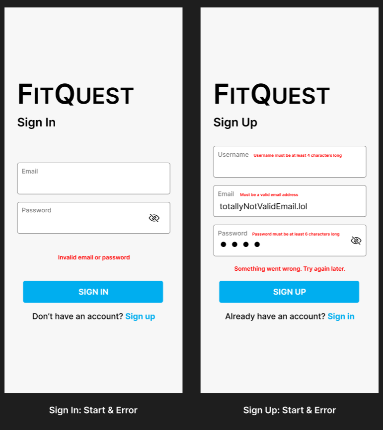

<h1 align="center">
    💪 FitQuest
</h1>
<p align="center">Gamified fitness app that transforms users' fitness progress into engaging RPG-style adventures!</p>

<div align="center">

   [Team Resources](./team-resources.md)

</div>

<p align="center">
  <a href="#-features">Features</a>&nbsp;&nbsp;&nbsp;|&nbsp;&nbsp;&nbsp;
  <a href="#-setup">Setup</a>&nbsp;&nbsp;&nbsp;|&nbsp;&nbsp;&nbsp;
  <a href="#-technologies">Technologies</a>&nbsp;&nbsp;&nbsp;|&nbsp;&nbsp;&nbsp;
  <a href="#%EF%B8%8F-roadmap">Roadmap</a>&nbsp;&nbsp;&nbsp;|&nbsp;&nbsp;&nbsp;
  <a href="#%EF%B8%8F-images">Images</a>&nbsp;&nbsp;&nbsp;|&nbsp;&nbsp;&nbsp;
  <a href="#-contributors">Contributors</a>
</p>

## ✨ Features

- **Quest-Motivated Workouts**

   Users complete workouts by logging physical activities to gain progression on quests they embarked on.

- **Avatar/Character Progression System**

   Customizable avatars that level up and gain equipment/abilities based on user activities.


- **Dynamic Turn-Based Combat**

   As users progress through quests, they will have the opportunity to fight against monsters and bosses to claim their hard-earned rewards.

- **Social Connection**

  Connect with friends, and see when they last did a workout.

- **Reward System with Badges and Items**

   Earn virtual rewards to enhance the gaming experience.


## 📋 Setup

Before you start, you will need to have the following tools installed on your PC/Laptop:
[Git](https://git-scm.com), [Node.js](https://nodejs.org/en/) (LTS).
In addition, it is good to have an editor to work with the code such as [VSCode](https://code.visualstudio.com/).

### Project installation

1. Clone the repository:

   ```bash
   git clone https://github.com/cse403-fitquest/fitquest
   cd fitquest
   ```

2. Install dependencies

   ```bash
   npm install
   ```

3. Run the app

   ```bash
   npx expo start -c
   ```

4. Setup device for development.

   For now, the easiest and recommended way to view the app is to use your physical device through expo. On the Play Store (Android) or App Store (iOS), download Expo Go. When the app is running after completing step 3, scan the QR code given in the terminal in the Expo Go application.

   But if you want to work with an emulator (android/ios) instead, follow instructions in this site: https://docs.expo.dev/get-started/set-up-your-environment/?platform=android&device=simulated

### Configure linting

1. Install the ESLint extention on VSCode.

2. Reload VSCode to see changes.

3. For ease of use, make sure to turn enable format-on-save on VSCode settings.

### Firebase Setup

1. Access firebase console (https://console.firebase.google.com/)

2. Create a new project

3. Within the project, register a new **web** app

4. Copy the configuration parameters provided by firebase and set it in [firebaseConfig.ts](./firebaseConfig.ts). Example below

   ```typescript
   const firebaseConfig = {
      apiKey: "yourAPIKey",
      authDomain: "fitquest-xxxxx.firebaseapp.com",
      projectId: "fitquest-xxxxx",
      storageBucket: "fitquest-xxxxx.appspot.com",
      messagingSenderId: "XXXXXXXXXXXX",
      appId: "X:XXXXXXXXXXXX:web:XXXXXXXXXXXXXXXXXXXXXX",
      measurementId: "X-XXXXXXXXXX"
   };
   ```

5. Start (or restart if already running) the server

   ```bash
   npx expo start -c
   ```

## 🚀 Technologies

This app was built with the following technologies:

- Typescript
- React Native
- Nativewind
- Zustand
- Firebase

## 🛣️ Roadmap

- [x] Setup Firebase SDK
- [x] Implement Sign Up
- [x] Implement Sign In
- [ ] Implement Onboarding Wizard
   - [ ] Survey
   - [ ] Fitness level calculation
   - [ ] Allocate attribute points
- [ ] Implement Profile
   - [ ] Avatar
   - [ ] Attributes & inventory
   - [ ] Workouts per week graph
- [ ] Implement Workout
   - [ ] Active workout session
   - [ ] Workout templates
   - [ ] Calculate exp gain from workout
- [ ] Implement Quest
   - [ ] Active quest
   - [ ] Available quests this week
- [ ] Implement Fight
   - [ ] Speed turn system
   - [ ] Player and enemy sprite animations
   - [ ] Player turn actions
- [ ] Implement Shop
   - [ ] Consumables and inventory items
   - [ ] Confirmation on item purchase
- [ ] Implement Social
   - [ ] Display friends and requests
   - [ ] Add friend

## 🖼️ Images

<div align="center">

   &nbsp;

</div>

## 👥 Contributors

- [Afuza Afuzarahman](https://github.com/afutofu) - UI/UX/Frontend/Backend/QA
- [Steven Tang](https://github.com/ArcaneLG) - UI/UX/Frontend
- [Dominic Roser](https://github.com/Dominic-Roser) - Frontend/Backend/QA
- [Prayug Sigdel](https://github.com/Prayug) - Frontend/Backend
- [Adam Benazouz](https://github.com/adamben04) - Frontend/Backend
- [Colin Dao](https://github.com/ColinDao) - Backend
