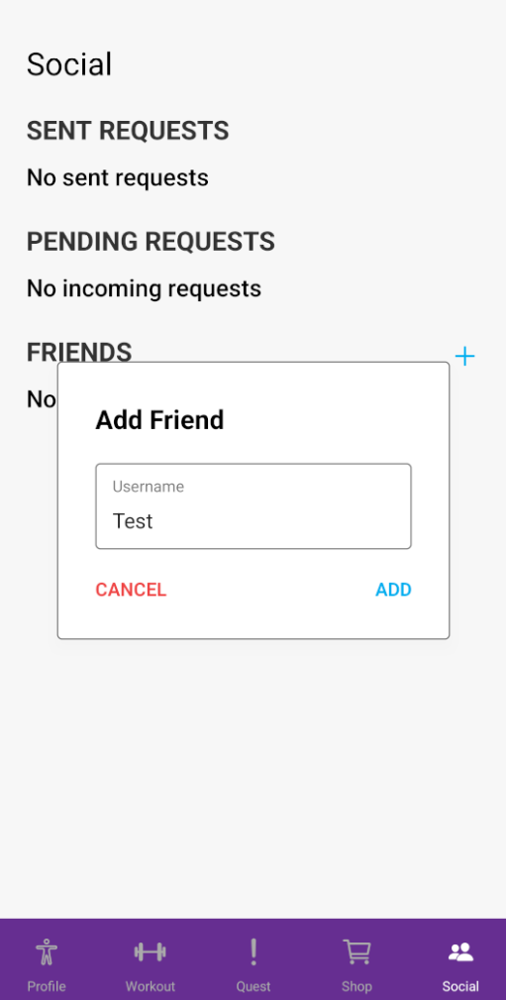
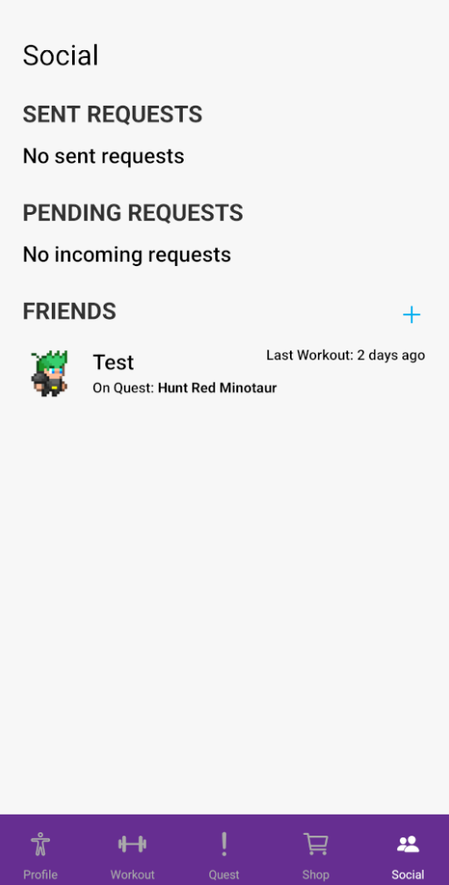

<h1 align="center">
    💪 FitQuest
</h1>
<p align="center">Gamified fitness app that transforms users' fitness progress into engaging RPG-style adventures!</p>

<div align="center">

   [Team Resources](./team-resources.md)&nbsp;&nbsp;&nbsp;|&nbsp;&nbsp;&nbsp;
   [User Documentation](./documentation/userDoc.md)&nbsp;&nbsp;&nbsp;|&nbsp;&nbsp;&nbsp;
   [Developer  Documentation](./documentation/devDoc.md)

</div>

<p align="center">
  <a href="#-features">Features</a>&nbsp;&nbsp;&nbsp;|&nbsp;&nbsp;&nbsp;
  <a href="#-setup">Setup</a>&nbsp;&nbsp;&nbsp;|&nbsp;&nbsp;&nbsp;
  <a href="#-technologies">Technologies</a>&nbsp;&nbsp;&nbsp;|&nbsp;&nbsp;&nbsp;
  <a href="#%EF%B8%8F-roadmap">Roadmap</a>&nbsp;&nbsp;&nbsp;|&nbsp;&nbsp;&nbsp;
  <a href="#%EF%B8%8F-images">Images</a>&nbsp;&nbsp;&nbsp;|&nbsp;&nbsp;&nbsp;
  <a href="#-contributors">Contributors</a>
</p>

## ✨ Features

- **Quest-Motivated Workouts**

   Users complete workouts by logging physical activities to gain progression on quests they embarked on.

- **Character Progression System**

   Users earn experience points to level up their character which gives them attribute points to spend on customizing how their character grows.

- **Dynamic Turn-Based Combat**

   As users progress through quests, they will have the opportunity to fight against monsters and bosses in a dynamic turn-based combat encounter.

- **Virtual Rewards**

   As users defeat monsters, they earn gold which can be used to purchase cooler and stronger items.

- **Social Connection**

  Connect with friends, see when they last did a workout and what quest they have embarked on this week.


## 📋 Setup

Before you start, you will need to have the following tools installed on your PC/Laptop:
[Git](https://git-scm.com), [Node.js](https://nodejs.org/en/) (LTS).
In addition, it is good to have an editor to work with the code such as [VSCode](https://code.visualstudio.com/).

### Project installation

1. Clone the repository:

   ```bash
   git clone https://github.com/cse403-fitquest/fitquest
   cd fitquest
   ```

2. Install dependencies

   ```bash
   npm install
   ```

3. Run the app

   ```bash
   npm start
   ```

4. Setup device for development.

   With an android device, the fastest way to use the app is to use your physical device through expo. On the Play Store, download Expo Go. When the app is running after completing step 3, scan the QR code given in the terminal in the Expo Go application.

   With an iOS device, you will need to work with an android emulator. Following the below instructions will take around 15 minutes to setup depending on whether you have installed android studio: https://docs.expo.dev/get-started/set-up-your-environment/?platform=android&device=simulated&mode=expo-go

### Firebase Setup (OPTIONAL)

Skip this setup if you want to use data provided by us. You only need to do this setup if you wish to use your own set of data that the app can interface with.

1. Access firebase console (https://console.firebase.google.com/)

2. Create a new project

3. Within the project, register a new **web** app

4. Copy the configuration parameters provided by firebase and set it in [firebaseConfig.ts](./firebaseConfig.ts). Example below

   ```typescript
   const firebaseConfig = {
      apiKey: "yourAPIKey",
      authDomain: "fitquest-xxxxx.firebaseapp.com",
      projectId: "fitquest-xxxxx",
      storageBucket: "fitquest-xxxxx.appspot.com",
      messagingSenderId: "XXXXXXXXXXXX",
      appId: "X:XXXXXXXXXXXX:web:XXXXXXXXXXXXXXXXXXXXXX",
      measurementId: "X-XXXXXXXXXX"
   };
   ```

5. You will need to add two new products in your firebase project, Authentication and Firestore. Let's configure both of them:

      a. For the Authentication product, simply choose Authentication from the list of products (should also be the first option in recommended products).

      b. Click Get Started

      c. When prompted for a sign in method, simply click "Email/Password".

      d. Enable Email/Password, and ensure that Email Link (passwordless sign-in) is disabled. You should be set for authentication now.

      e. For Firestore, simply browse the list of products and click on "Cloud Firestore".

      f. Once initialized, click on the "Create database" button.

      g. You will now be asked a series of questions to setup the database.

      h. For setting location, pick the location closest to you.

      i. For rules, pick test mode.

      j. Wait a couple seconds for the database to initialize

      k. After the database has been created, head over to the "Rules" tab and past the following ruleset:

         rules_version = '2';
         service cloud.firestore {

            match /databases/{database}/documents {
            
               // Shop Item collection where each document corresponds to an item
               match /items/{itemId} {
                  
                  // Only allow read for authenticated users
                  allow read: if request.auth != null;
               
                  allow create: if request.auth != null;
                  
                  allow update: if request.auth != null;
                  
                  allow delete: if request.auth != null;
               }

               // Friends collection where each document corresponds to a user
               match /friends/{userId} {

                  // Only authenticated users can read their own friends document
                  allow read: if request.auth != null;
                  
                  // Only authenticated users can create their own initial friends document
                  allow create: if request.auth != null && request.auth.uid == userId;

                  // Allow updates only if the user is authenticated and is modifying their own document
                  allow update: if request.auth != null && (
                  
                     // Only allow updates for specified fields: 'pendingFriendRequests', 'sentFriendRequests', 'friends'
                     request.resource.data.keys().hasAny(['pendingRequests', 'sentRequests', 'friends']) && 
                  
                     // Ensure the update does not remove any other fields
                     request.resource.data.size() == resource.data.size() || 
                  
                     // Or, the update must be limited to the allowed fields only
                     request.resource.data.keys().hasOnly(['pendingRequests', 'sentRequests', 'friends'])
                  );
               }
               
               // Users collection where each document corresponds to a user's profile
               match /users/{userId} {
               
                  // Allow read access to user data for authenticated users
                  allow read: if request.auth != null;
                  
                  // Allow create access to user data for authenticated users for initial user data
                  allow create: if request.auth != null && request.resource.data.id == request.auth.uid;

                  // Allow the user to update their consumables or equipment
                  allow update: if request.auth != null 
                  // && request.auth.uid == userId && (
                  //   request.resource.data.keys().hasAny(['equippedItems', 'items'])
                  // );

                  // Prevent overwriting the entire user document
                  // allow update: if request.resource.data.size() == resource.data.size();
               }
               
               match /quests/{quest} {
                  allow read, write:  if request.auth != null;
               }
            }
         }

      l. Your firebase project should now be set up properly. Move on to creating collections and documents inside the database.

7. You will need to create a "quests", "items", "users", and "friends" collection in firestore.

      a. For the quests collection, you will need to fill in dummy data in the form:

      ```typescript
      // An map with key-value pairs like below. '1' is the id of the quest.
      '1': {
         name:'Hunt Red Minotaur',
         questDescription: '',
         milestones: [
            50, 100, 150, 200, 250, 300, 350, 400, 450, 500, 550, 600, 650, 700, 750, 800, 850, 900, 950, 1000
         ],
         bossThreshold: 500,
         duration: 7 * 24 * 60 * 60 * 1000,
         normalMonsters: [
            {
            name: 'Green Slime',
            maxHealth: 80,
            health: 80,
            power: 8,
            spriteId: 'slime_green',
            },
            {
            name: 'Blue Slime',
            maxHealth: 85,
            health: 85,
            power: 9,
            spriteId: 'slime_blue',
            },
            {
            name: 'Red Slime',
            maxHealth: 75,
            health: 75,
            power: 7,
            spriteId: 'slime_red',
            },
         ],
         boss: {
            name: 'Red Minotaur',
            maxHealth: 200,
            health: 200,
            power: 15,
            speed: 15,
            spriteId: AnimatedSpriteID.MINOTAUR_RED,
         },
         createdAt: '',
         expiredAt: '',
      },
      ```

   b. For items collection, you will need to fill in data for items for users to purchase in the form:

      ```typescript
      {
         id: "t1_dagger",
         name: "T1 Dagger",
         type: "WEAPON"
         description: "Small but mighty! Perfect for poking holes in your enemies' plans."
         spriteID: "t1_dagger"
         power: 5,
         speed: 10,
         health: 0,
         cost: 50,
         createdAt: November 9, 2024 at 6:37:29 PM UTC-8
      }
      ```

   c. Users collection can be left empty, as new documents will be created as new users registers an account.

   d. Friends collection can also be left empty, as new documents and relations will be made as users add friends.

5. Start (or restart if already running) the server

   ```bash
   npm start
   ```

### Configure linting

1. Install the ESLint extention on VSCode.

2. Reload VSCode to see changes.

3. For ease of use, make sure to turn enable format-on-save on VSCode settings.

### Testing

1. Tests for the app can be run automatically with the following command:

   ```bash
   npm run test
   ```

   or you can run it in watch mode which reruns the tests automatically when saving changes with the following command:

   ```bash
   npm run test:dev
   ```

2. Locate app tests under the `tests` folder in the root directory. There are unit tests for three parts of the app: reusable frontend components, services that interface with the firebase backend, and utility functions used throughout the different modules of the app.

3. To start creating a new test, find an existing file module (auth, user, etc) or create a new file for a non-existant module to test for.

4. Write tests in accordance to the existing testing convention. Look into sibling files or tests within the same file module you are testing to see how you should be writing your tests.


## 🚀 Technologies

This app was built with the following technologies:

- Typescript
- React Native
- Tailwind
- Zustand
- Firebase

## 🛣️ Roadmap

- [x] Setup Firebase SDK
- [x] Implement Sign Up
- [x] Implement Sign In
- [x] Implement Onboarding Wizard
   - [x] Survey
   - [x] Fitness level calculation
   - [x] Allocate attribute points
- [ ] Implement Profile
   - [x] Avatar
   - [x] Attributes & inventory
   - [ ] Workouts per week graph
- [ ] Implement Workout
   - [x] Active workout session
   - [ ] Workout templates
   - [ ] Calculate exp gain from workout
- [x] Implement Quest
   - [x] Active quest
   - [x] Available quests this week
- [x] Implement Fight
   - [x] Speed turn system
   - [x] Player and enemy sprite animations
   - [x] Player turn actions
- [x] Implement Shop
   - [x] Consumables and inventory items
   - [x] Confirmation on item purchase
- [x] Implement Social
   - [x] Display friends and requests
   - [x] Add friend

## 🖼️ Images

<div align="center">

   &nbsp;
   &nbsp;

</div>

<div align="center">

   &nbsp;
   &nbsp;
   &nbsp;
   &nbsp;

</div>

<div align="center">

   &nbsp;
   &nbsp;

</div>

<div align="center">

   &nbsp;
   &nbsp;
   &nbsp;
   &nbsp;

</div>

## 👥 Contributors

- [Afuza Afuzarahman](https://github.com/afutofu) - UI/UX/Frontend/Backend/QA
- [Steven Tang](https://github.com/ArcaneLG) - UI/UX/Frontend/QA
- [Dominic Roser](https://github.com/Dominic-Roser) - Frontend/Backend/QA
- [Prayug Sigdel](https://github.com/Prayug) - Frontend/Backend
- [Adam Benazouz](https://github.com/adamben04) - Frontend/Backend
- [Colin Dao](https://github.com/ColinDao) - Backend
