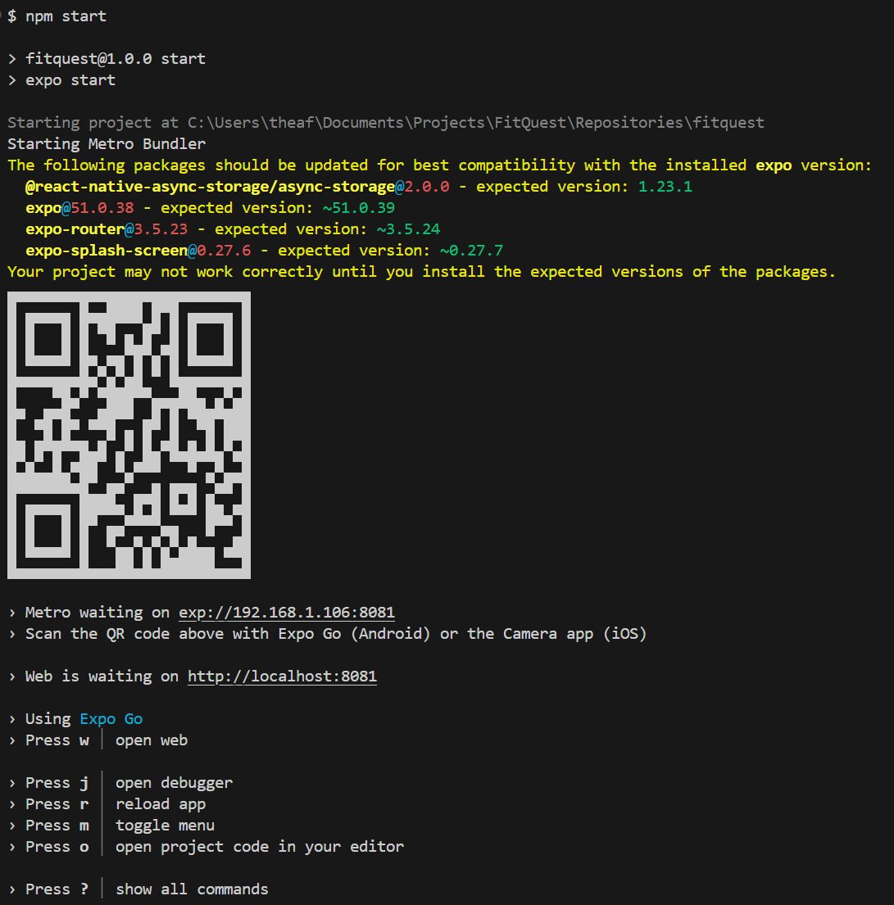
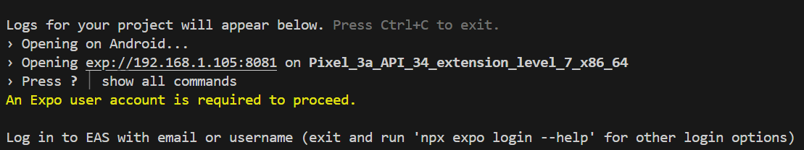

### Developer Documentation

# FitQuest Developer Guidelines

### **1. How to Obtain the Source Code**
The FitQuest source code is hosted on GitHub. To obtain the source code, follow these steps:

1. Clone the Repository:

    - Open your terminal or command prompt.

    - Run the following command to clone the repository:

        ```bash
        git clone https://github.com/cse403-fitquest/fitquest.git
        ```

2. Navigate to the Project Directory:

    ```bash
    cd fitquest
    ```

#

### **2. Directory Structure Layout**
The FitQuest project follows a modular directory structure to enhance maintainability and scalability. Below is an overview of the directory layout:

```bash
fitquest/
├── .github/
│   └── workflows/                  # GitHub Actions workflow configurations
├── app/                            # Screens
│   ├── auth/                       # Auth screens
│   ├── onboarding/                 # Onboarding screens
│   └── tabs/                       # Tab screens
├── assets/                         # Spritesheets, fonts, and other static assets
├── components/                     # Reusable React Native components
├── constants/                      # Constants for mocks and base objects
├── store/                          # Hooks for global state management
├── services/                       # Functions that interact with the backend
├── utils/                          # Utility functions and helper modules
├── types/                          # Types for various modules
├── documentation/                  # User and developer documentation
├── tests/
│   ├── unit/
│   │   ├── components/__tests__/   # Unit test files for components
│   │   ├── services/__tests__/     # Unit test files for services functions
│   │   └── utils/__tests__/        # Unit test files for utility functions
|   └── integration/
│       ├── workout/__tests__/      # Integration test files for workout module
│       ├── fight/__tests__/        # Integration test files for fight module
│       ├── quest/__tests__/        # Integration test files for quest module
│       └── shop/__tests__/         # Integration test files for shop module
├── eslint.config.mjs               # ESLint configuration
├── package.json                    # Project dependencies and scripts
├── README.md                       # Project overview
└── ...                             # Additional configuration and documentation files
```

- **app/:** Contains the various screens presented in the app. File-based routing using Expo.

- **components/:** Contains reusable UI components like buttons, avatars, and input fields.

- **services/:** Manages API integrations, authentication logic, and business rules.

- **utils/:** Includes utility functions used across the application, such as fitness level calculations.

- **assets/:** Stores static assets like spritesheets, icons, and fonts.

- **store/:** Provides react hooks for global state management using Zustand libary.

- **tests/:** Contains all test files, organized by unit and integration folders containing relevant tests for component, services functions, utility functions, and screen behaviors.

- **.github/workflows/:** Stores GitHub Actions workflow YAML files for CI/CD processes.

#

### **3. How to Build the Software**

Before you start, you will need to have the following tools installed on your PC/Laptop:
[Git](https://git-scm.com), [Node.js](https://nodejs.org/en/) (20.x LTS).
In addition, it is good to have an editor to work with the code such as [VSCode](https://code.visualstudio.com/). Moreover, ensure you have an Expo user account. You can make one at this [page](https://expo.dev/signup). You will need an account to run the app and will be prompted after trying to connect the app to the emulator or device. This will ease development as running the app in online mode (default) lets us automatically install the development environment (Expo Go) automatically in our android emulator (in the following steps).

To build FitQuest, follow these steps:

1. Checkout to appropriate branch:

    - Depending on whether you want the stable release or the current development branch, checkout to either `main` or `develop` branch respectively.

    - Run either:

        ```bash
        git checkout main
        ```

        or

        ```bash
        git checkout develop
        ```

2. Install dependencies

   ```bash
   npm install
   ```

3. Install eas-cli


   ```bash
   npm install -g eas-cli
   ```

3. Run the app

   ```bash
   npm start
   ```

   This should display the following:

   

   a. If the QR is not displayed, it is likely that you did not do the previous steps correctly. Ensure your node version is 20.x LTS, delete the `package-lock.json` file and `/node_modules` folder generated in step 2, then do another `npm install` and `npm start`.

4. Setup device for development. Run on physical Android device using expo QR code or run on Android Emulator:

   With an android device, the fastest way to use the app is to use your physical device through expo. Download and install Expo Go SDK 51 (https://expo.dev/go?sdkVersion=51&platform=android&device=true). When the app is running after completing step 3, scan the QR code given in the terminal in the Expo Go application. If it takes too long to load (over several minutes), you may need to reload the app by pressing "r" in the terminal as shown in the screenshot above. For more troubleshooting guide, refer to the Troubleshoot section below.

   Our app currently does not support iPhones, so using Expo Go with your iPhone will likely result in a crash or unintended bug(s).

   With other devices such as a laptop, you will need to work with an android emulator to run the app. Following the instructions from the link will take around 15 minutes to setup depending on whether you have installed android studio: https://docs.expo.dev/get-started/set-up-your-environment/?platform=android&device=simulated&mode=expo-go. Be sure to select "Android Emulator" for the first option and "Expo Go" for the second option.

5. Login with your Expo account. After connecting with either the emulator or your android device, you will be prompted to login with your Expo user account. Simply follow the steps given and you will be succesfully logged in and the app should be initialized. If it is taking too long, try closing the server and start again from step 3.

   

> **Note:** Ensure you have the necessary emulators or physical devices connected for testing.

### **4. How to Test the Software**

Running Tests:

1. Unit Tests:

    - Execute the following command to run all Jest tests:

        ```bash
        npm test
        ```

    - Or you can run it in watch mode which reruns the tests automatically when saving changes with the following command:

        ```bash
        npm run test:dev
        ```

**Accessing Test Results:**

- Test results will be displayed in the terminal after execution.

### **5. How to Add New Tests**
Adding a new unit test:

1. Identify the Component or Function:

    - Determine which component, utility function, or service function you want to unit test.

2. Create a Test File:

    - For a component named NewComponent, create NewComponent.test.tsx in the appropriate `__tests__` directory, e.g., `/tests/unit/components/__tests__/NewComponent.test.tsx`.

3. Write Test Cases:

    - Use Jest and React Native Testing Library for unit and integration tests.

    **Example for a Service / Utility Function:**

    ```typescript
    // /tests/unit/utils/__tests__/newFunction.test.tsx
    import { newFunction } from '@utils/newFunction.ts';

    describe('newFunction', () => {
    it('should return expected output for given input', () => {
        const input = 'test input';
        const expectedOutput = 'expected output';
        expect(newFunction(input)).toBe(expectedOutput);
    });

    // Additional test cases...
    });
    ```

    **Example for a Component:**

    ```typescript
    // /tests/components/__tests__/NewComponent.test.tsx
    import React from 'react';
    import { render, fireEvent } from '@testing-library/react-native';
    import NewComponent from '@/components/NewComponent';

    describe('NewComponent', () => {
    it('renders correctly with default props', () => {
        const { getByTestId } = render(<NewComponent />);
        const element = getByTestId('new-component');
        expect(element).toBeTruthy();
    });

    it('handles user interaction correctly', () => {
        const onPressMock = jest.fn();
        const { getByTestId } = render(<NewComponent onPress={onPressMock} />);
        const button = getByTestId('new-button');
        fireEvent.press(button);
        expect(onPressMock).toHaveBeenCalled();
    });

    // Additional test cases...
    });
    ```

4. Run the Tests:

    - Execute `npm test` to ensure your new tests pass.

5. Commit the Test File:

    - Checkout to a new branch from the `develop` branch (with latest changes) with an appropriate prefix (eg. fix/, feat/, refactor/, test/)
    - Add and commit changes to your new brench
    - Create a pull request and request to be reviewed by one of the other developers

        ```bash
        git checkout -b test/new-component
        git add /tests/unit/components/__tests__/NewComponent.test.tsx
        git commit -m "Add tests for NewComponent"
        git push --set-upstream origin test/new-component
        ```

Add new integration test

1. The same steps for adding a new unit test applies to adding a new integration test. The only difference being the location the test is stored in and the tests written.

2. Create a new `MODULE_TO_TEST.tsx` file in the appropriate `__tests__` directory in the integration test directory, e.g., `/tests/integration/workout/__tests__/MODULE_TO_TEST.test.tsx`.

3. Refer to sibling files or other files within the integration test directory for a good example of how to write new integration tests. The same applies for unit tests.


**Conventions:**

- Test files should follow the pattern ComponentName.test.tsx or functionName.test.tsx.

- Place test files in their respective __tests__ directories for organization.

### **6. How to Build a Release of the Software**

**Building a Release:**

1. Make sure you are on the `develop` branch

2. Update Version Number:

    - Increment the version number in package.json following semantic versioning (e.g., 1.0.0 to 1.1.0).

3. Run Tests:

    - Ensure all tests pass by running:

        ```bash
        npm test
        ```

4. Make a pull request to the `main` branch.

5. Wait for workflow scripts to succesfully test, lint, and build the app into an APK file.

6. Ask the administrator for a link to the latest build on the expo project website.

7. Update the link in README and push this new commit to the pull request with a [skip ci] prefix in the message to ensure that the new commit does not run another CI workflow.4

    ```bash
    git commit -m "[skip ci] update build link in README and user documentation YYYY-MM-DD"
    ```

8. Request a review from one of the code maintainers for approval and wait for them to merge the code.