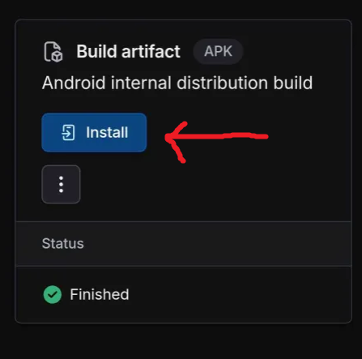
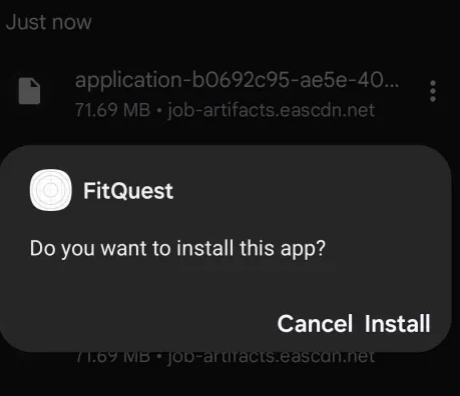
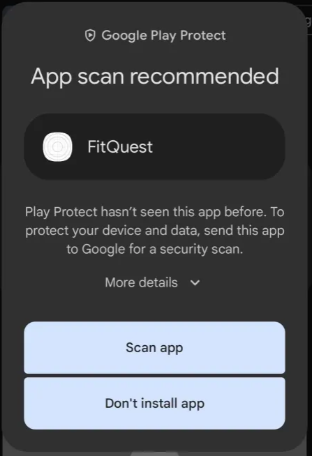
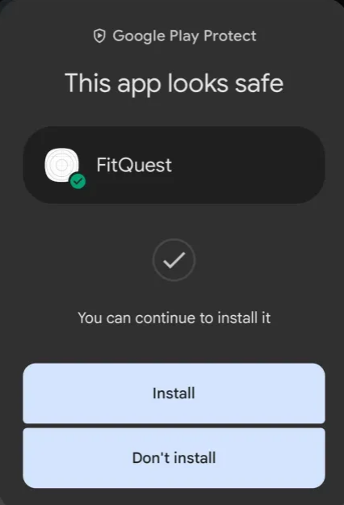
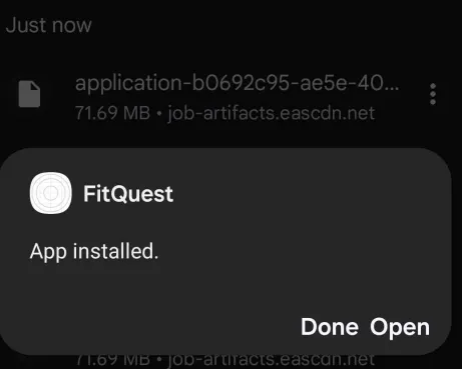

### User Documentation

# FitQuest User Manual

**1. High-Level Description**

**FitQuest** is a gamified fitness application designed to transform your workout routine into an engaging RPG-style adventure. By completing real-world physical activities, you embark on quests, battle monsters, and level up your customizable avatar. FitQuest motivates users to stay active by integrating game mechanics with fitness tracking, making exercise both fun and rewarding.

#

**2. How to Install the Software**

Prerequisites:

**Mobile Device:** Android (version 8.0 or later).

**Internet Connection:** Required for syncing data.

Installation Steps:

1. Click this [link](https://expo.dev/accounts/afuza/projects/fitquest/builds/02729e56-2c3a-4e20-ad9c-1e6d6ee0cb7f) which takes you to the page where you can install the APK file to run the app.

2. Once the page is loaded, simply click on the install button as shown in the screenshot below to download the apk file

    

> **Note:** Ensure your device meets the minimum OS requirements and has sufficient storage space for installation.

#

**3. How to Run the Software**

1. Once downloaded, simply click on the executable to install the app to your device.

    <!--  -->
    

    - If its your first time downloading, you may get the following prompt by Google Play Protect to scan the app. If you do, simply allow it to scan the app and proceed with the installation. After scanning is finished, it will prompt you to install the app again.

        

        

2. Once installation is successful, the app should be installed in your device called FitQuest. Either navigate to the icon or search it in your search bar and launch the app. Or open it directly straight after installation.

    

3. Congratulations! You can now level up your health!

#

**4. How to Use the Software**

Main Features:

- **Onboarding Wizard:** Assess your fitness level by allocating points to POWER, SPEED, and HEALTH attributes.

- **Quests:** Complete workouts to progress through quests, earn experience points (XP), and battle monsters.

- **Avatar Customization:** Personalize your avatar with various weapons, armor, and accessories.

- **Turn-Based Combat:** Engage in battles against monsters and bosses to claim rewards.

- **Social Connections:** Add friends and view what quests they are on.

- **Reward System:** Earn items to make your avatar stronger.

Using FitQuest:

1. Select a Quest:

    - Navigate to the "Quests" section and choose a quest that you find exciting.

2. Complete Workouts:

    - Perform the workouts in the Workout tab. When completing workouts, you will gain XP, making you progress in your current active quest.

3. Battle Monsters:

    - Progressing through quests may trigger monster encounters. Use your avatar's abilities and equipment to defeat them.

4. Customize Your Avatar:

    - Visit the "Profile" section to change your avatar's items and upgrade attributes as you level up.

**Work in Progress:**

- We currently do not have any features pending to implement anytime soon. Any suggestions can be made to our [Github Issues Page](https://github.com/cse403-fitquest/fitquest/issues).

#

**5. How to Report a Bug**

To help us improve FitQuest, please report any bugs you encounter using our [GitHub Issues](https://github.com/cse403-fitquest/fitquest/issues) tracker.

**Reporting a Bug:**

1. Visit the Issue Tracker:

    - Go to our GitHub Repository Issues Page.

2. Create a New Issue:

    - Click on the "New Issue" button.

3. Fill Out the Bug Report Template:

    - **Title:** Provide a clear and concise title for the bug.

    - **Description:** Describe the bug in detail, including the steps to reproduce it.

    - **Expected Behavior:** Explain what you expected to happen.

    - **Actual Behavior:** Describe what actually happened.

    - **Screenshots:** Attach any relevant screenshots or recordings.

    - **Environment:** Specify the device, OS version, and app version where the bug occurred.

4. Submit the Issue:

    - Once all fields are completed, submit the issue for review.

#

**6. Known Bugs**

- We currently do not have any bugs as part of our testing. However, that does not mean our app is 100% bug free. If you notice any bugs, please support us by making it known by creating an issue to our [Github Issues Page](https://github.com/cse403-fitquest/fitquest/issues) so we can take a look at it. Thank you for using our app!
